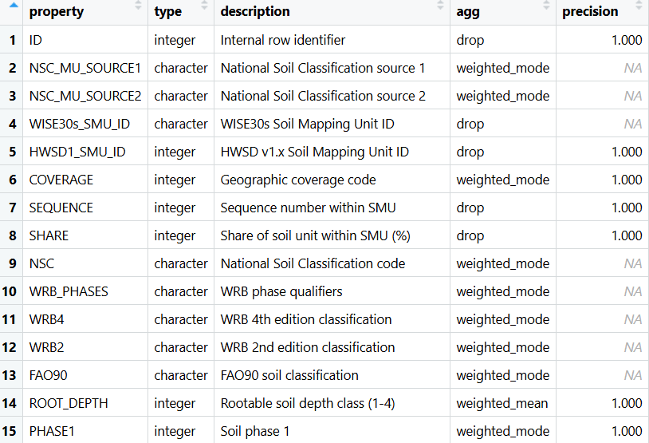
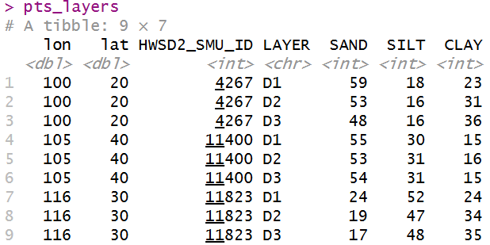
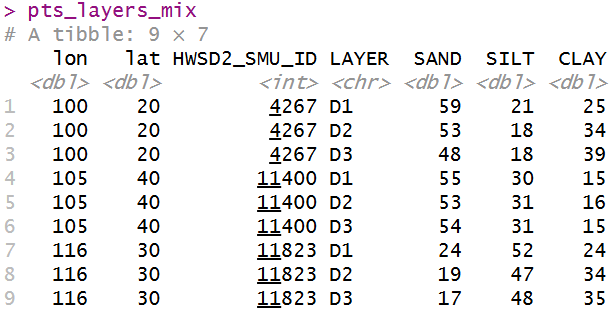
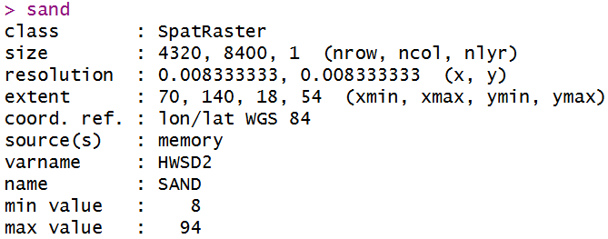
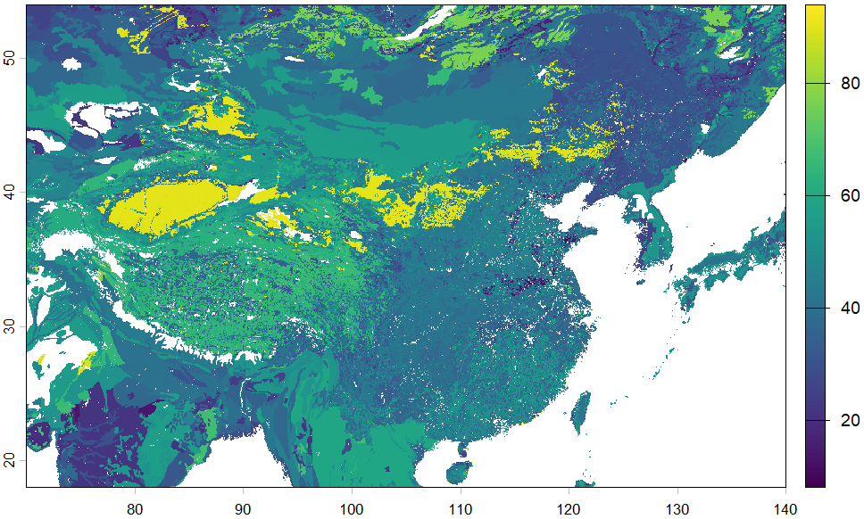
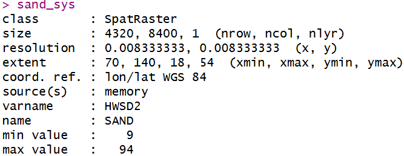
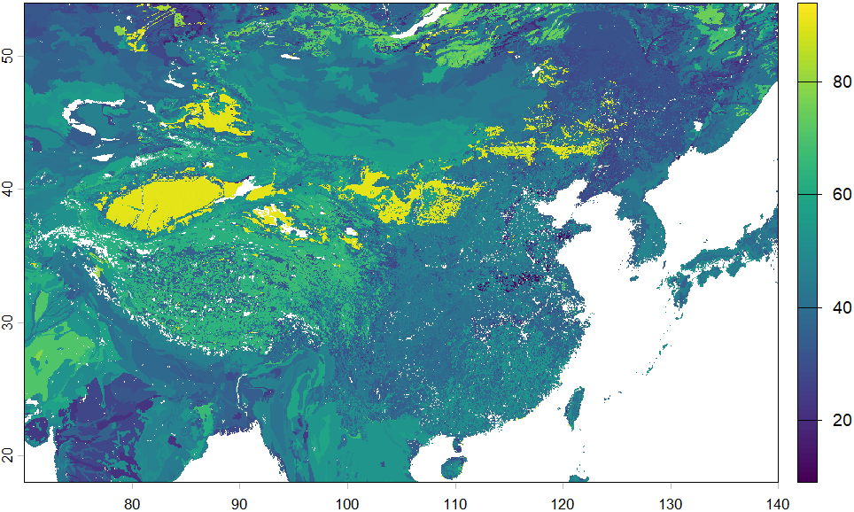
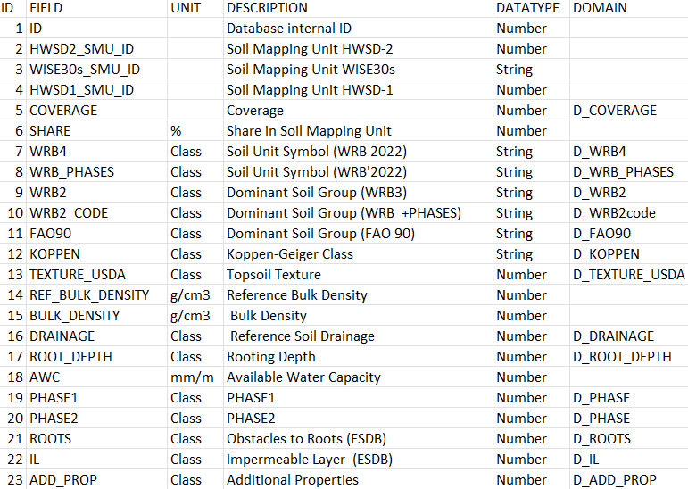
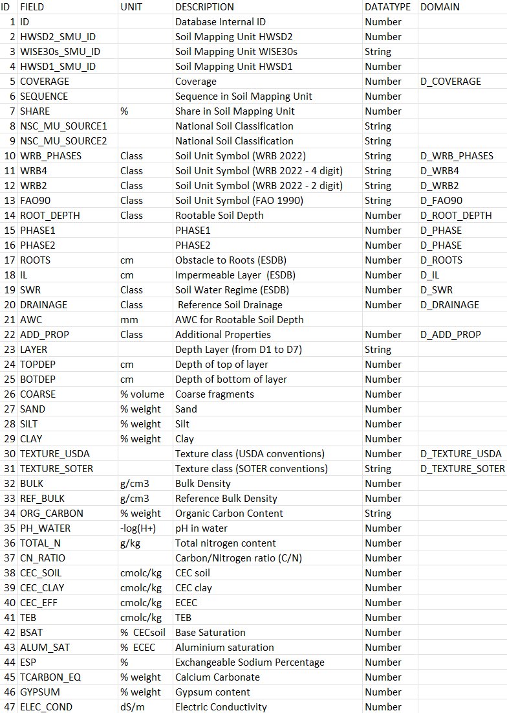

本项目主要包括两方面内容：一是快速提取单点/多点、区域的HWSD数据；二是制作并提供全球0-200 cm七个土层土壤属性栅格。

# HWSD介绍

**世界土壤数据库（Harmonized World Soil Database, HWSD）** 是由联合国粮食及农业组织（FAO）和国际应用系统分析研究所（IIASA）等机构共同开发的全球土壤数据库。HWSD v2.0是该数据库的最新版本，于2023年发布。作为土壤科学领域的标杆性资源，其整合了180余个国家的土壤调查数据，覆盖了除南极洲的全球陆地区域，**空间分辨率达30弧秒（约为1公里）**，为农业、生态环境及气候变化等研究提供了核心支撑。中国地区数据源为中国科学院南京土壤研究所提供的1995年全国第二次土壤普查1:100万的土壤数据，采用的分类系统主要为FAO-90。

与之前的版本相比，**HWSD v2.0**提高了制图单元数量，拥有近30,000个土壤制图单元（soil mapping units, SMU），每个土壤单元包含多个土壤类型和相位的组合。土壤深度层方面，从原来的两个深度层扩展到**七个深度层，分别覆盖0–20、20–40、40–60、60–80、80–100、100–150和150–200 cm（按D1、D2、……、D7表示）**。每个土壤制图单元的每个深度层包含至少1种至多12种土壤，每种土壤有超过40种理化指标，包括有机碳含量、pH、土壤质地、阳离子交换量、有效水分、土壤盐分等。

> 每个土壤制图单元（SMU）里可能存在1-12种土壤类型，每个类型占据一定比例（由SEQUENCE和SHARE字段记录）。**主导土类是SEQUENCE=1的土壤类型，也是理论上SHARE最大的组分。** 占比最高的土壤常被视为主导类型，许多简化分析即以此代表整个像元的土壤特性。但官方手册指出，建模时应考虑制图单元内所有土壤成分，只用主导土类会误导。

HWSD数据可以通过官方网站进行下载：

[Harmonized world soil database v2.0 \| FAO SOILS PORTAL](https://www.fao.org/soils-portal/data-hub/soil-maps-and-databases/harmonized-world-soil-database-v20/en/ "Harmonized world soil database v2.0 | FAO SOILS PORTAL | Food and Agriculture Organization of the United Nations")

[HWSD \| GAEZ v4 Data Portal](https://gaez.fao.org/pages/hwsd "HWSD | GAEZ v4 Data Portal")

[HWSD \| ISRIC Data Hub](https://data.isric.org/geonetwork/srv/eng/catalog.search#/metadata/54aebf11-ec73-4ff8-bf6c-ecff4b0725ea "HWSD | ISRIC Data Hub")

该数据库配套提供了土壤数据查看器（.exe）、**土壤基准栅格文件（.bil）**、**土壤属性数据库（.mdb）** 以及技术说明文件。土壤数据查看器本地安装后，其可视化界面可提供对土壤栅格单元和土壤属性关联信息的直接查看。**官网数据库中土壤栅格单元与土壤属性是分开存储的**，故在本地计算前，应对数据进行处理，流程如下。

# HWSD数据提取

利用R语言 [tidyhwsd包](https://github.com/Rimagination/tidyhwsd "Rimagination/tidyhwsd") 提取HWSD数据，实现单点/多点、多土层、区域数据的快速提取。

## tidyhwsd包介绍

tidyhwsd包将HWSD“索引栅格 + 属性表”的关联与拼接过程封装为简洁的R函数，显著降低了GIS数据处理门槛。**点位提取会返回 tibble，区域提取会返回 terra::SpatRaster。** 可以用它快速查看某个地点的土壤属性，也可以生成某一区域的土壤栅格图层。

tidyhwsd包采用两种方式交付数据：一是在SMU内按传统的方式筛选每个土壤单元的主土类（序列SEQUENCE为1的土类），返回“主导土壤”结果；二是在制图单元内按占比加权平均（数值变量）或者取众数（分类变量），并允许用户设置具体哪个参数采用哪种方式。

该函数包的使用说明：

[R语言 \| tidyhwsd包快捷提取世界土壤数据HWSD v2.0](https://mp.weixin.qq.com/s/DCXVCcJMQq3S7bBbWRNGww)

[R语言 \| tidyhwsd包更新及世界土壤数据提取误区](https://mp.weixin.qq.com/s/kunMKfsU9-i1BiiFVKuj2Q)

## tidyhwsd使用

```r
# 安装并载入tidyhwsd包
# install.packages("remotes")
# remotes::install_github("Rimagination/tidyhwsd")
library(tidyhwsd)

# 指定HWSD2源数据存储位置
ws_path <- 'D:/R/Markdown/HWSD2/data'
# 自动下载索引栅格
hwsd_download(ws_path = ws_path, verbose = TRUE)

# 载入函数包内置属性列表
props <- hwsd_props()
View(props)
```



## 位点数据提取

**利用`hwsd_extract()`快速提取主导土类的属性。**

```r
# 构建多点经纬度向量
sites <- data.frame(
  lon = c(100, 105, 116),
  lat = c(20, 40, 30))
pts_layers <- hwsd_extract(
  # coords = c(110, 40), # 指定单位点经纬度
  coords = sites, # 指定多位点经纬度
  param = c("SAND", "SILT", "CLAY"), # 指定土壤属性名称
  layer = c("D1", "D2", "D3"), # 指定若干土层
  output = "long", # 多土层时应显式指定长数据格式，否则采用wide
  ws_path = ws_path) # 指定HWSD2索引栅格所在文件夹
pts_layers
```



如果设置 `param = "ALL"`，结果将返回所有属性。有时返回结果中会出现`NA`，这是因为该位点本身是水体、岩石等，其原始记录值为负值，在输出时被自动转为`NA`。

**利用`hwsd_compose()`提取土壤属性合成值。** 默认规则是：对于连续变量，按加权平均（weighted_mean）给出合成值；对于分类变量，按加权众数（weighted_mode）给出最终值。

> 加权众数： 对同一土壤单元内所有土壤类型的某个分类属性（如 DRAINAGE），把属于同一级别的SHARE先加总，再选总占比最高的那个类别作为结果。

```r
props <- hwsd_props()
# 构建多点经纬度向量
sites <- data.frame(
  lon = c(100, 105, 116),
  lat = c(20, 40, 30))
pts_layers_syn <- hwsd_compose(
  # coords = c(110, 40), # 指定单位点经纬度
  coords = sites, # 指定多位点经纬度
  param = c("SAND", "SILT", "CLAY"), # 指定土壤属性名称
  props = props,
  layer = c("D1", "D2", "D3"), # 指定若干土层
  output = "long", # 多土层时应显式指定长数据格式，否则采用wide
  ws_path = ws_path) # 指定HWSD2索引栅格所在文件夹
pts_layers_syn
```


**修改 props\$agg 可以指定特定变量合成值的聚合规则。**

```r
# 以SAND为例，改用主导值输出。
props <- hwsd_props()
props$agg[props$property == "SAND"] <- "dominant"

sites <- data.frame(
  lon = c(100, 105, 116),
  lat = c(20, 40, 30))
pts_layers_mix <- hwsd_compose(
  # coords = c(110, 40), # 指定单位点经纬度
  coords = sites, # 指定多位点经纬度
  param = c("SAND", "SILT", "CLAY"), # 指定土壤属性名称
  props = props,
  layer = c("D1", "D2", "D3"), # 指定若干土层
  output = "long", # 多土层时应显式指定长数据格式，否则采用wide
  ws_path = ws_path) # 指定HWSD2索引栅格所在文件夹
pts_layers_mix
```



## 区域数据提取

调用参数`bbox`替代`coord`，以进行区域栅格属性数据提取。

```r
# 指定区域范围
bbox_cn <- c(70, 18, 140, 54) # lon_min, lat_min, lon_max, lat_max
sand <- hwsd_extract(
  bbox = bbox_cn, # 指定查询区域经纬度
  param = "SAND", # 指定土壤属性名称
  layer = "D1", # 指定一个土层
  # tiles_deg = 5, # 分块大小（度）
  # cores = 4, # 并行处理核心数
  ws_path = ws_path) # 指定HWSD2索引栅格所在文件夹
sand
```



参数`tiles_deg`可以将区域进行分块处理，减少内存占用；`cores`指定并行处理核心数（仅支持非Windows系统）。

```r
# 可视化
library(terra)
terra::plot(sand)
# 保存
writeRaster(sand, "D:/R/Markdown/HWSD2/data/sand_D1_china.tif", overwrite = TRUE)
```



**利用`hwsd_compose()`同样可以实现区域属性合成值提取。**

```r
props <- hwsd_props()
# 构建区域经纬度
bbox_cn <- c(70, 18, 140, 54) # lon_min, lat_min, lon_max, lat_max
sand_sys <- hwsd_compose(
  bbox = bbox_cn, # 指定查询区域经纬度
  param = "SAND", # 指定土壤属性名称
  props = props,
  layer = "D1", # 指定一个土层
  ws_path = ws_path) # 指定HWSD2索引栅格所在文件夹
sand_sys
terra::plot(sand_sys)
```





# 全球栅格制作

基于HWSD v2.0，制作并提供全球0-200 cm七个土层土壤属性栅格。

分辨率1千米，采用GCS_WGS_1984坐标系。

20个数值变量：粗砂粒COARSE、砂粒SAND、粉粒SILT、黏粒CLAY、容重BULK、REF_BULK、有机碳ORG_CARBON、PH_WATER、全氮TOTAL_N、碳氮比CN_RATIO、阳离子交换量CEC_SOIL、CEC_CLAY、CEC_EFF、交换性盐基TEB、盐基饱和度BSAT、铝饱和度ALUM_SAT、交换性钠百分率ESP、碳酸钙TCARBON_EQ、石膏GYPSUM、电导率ELEC_COND、有效水AWC。

6个分类变量：土壤类型WRB_PHASES（WRB2022基础分类+土壤相）、WRB4（WRB2022基础分类）、FAO90、排水类别DRAINAGE、根系有效土壤深度ROOT_DEPTH、土壤质地TEXTURE_USDA。

根据下方代码导出的数据库数据表和变量栅格文件：<https://pan.baidu.com/s/1K9IJz5bIlhu8qgsoY57CnA?pwd=7u3m>

## 数据库数据表导出

```r
setwd('D:/R/Markdown/HWSD2') # set current working directory

# 载入函数包
if (!require(pacman)) {install.packages('pacman')}
pacman::p_load(openxlsx, tidyverse, RODBC)

# 指定数据库位置。将手动下载的HWSD2数据库提前放入data文件夹下
mdb_path <- 'data/HWSD2.mdb'

# 创建输出目录
out_dir <- 'HWSD2mdbExtract'
if (!dir.exists(out_dir)) dir.create(out_dir, recursive = TRUE)
```

```r
# 导出数据库所有数据表
conn_str <- paste0("Driver={Microsoft Access Driver (*.mdb, *.accdb)};DBQ=", mdb_path)
conn <- odbcDriverConnect(conn_str) # 连接到HWSD2数据库
# 获取数据库中所有表的名称
tables <- sqlTables(conn, tableType = "TABLE")
table_names <- tables$TABLE_NAME
# 循环读取每个表并保存为xlsx文件
for (table_name in table_names) {
  df <- sqlFetch(conn, table_name)
  safe_name <- gsub('[[:punct:]]', '_', table_name)
  output_file <- file.path(out_dir, paste0(safe_name, ".xlsx"))
  write.xlsx(df, output_file, rowNames = FALSE)
  cat(paste0("已保存: ", output_file, "\n\n"))
}
odbcClose(conn)
```

可见，HWSD v2.0主要包括两个数据表（HWSD2_SMU和HWSD2_LAYERS），两个表的元信息（字段单位、描述、数据类型）分别通过（HWSD2_SMU_METADATA和HWSD2_LAYERS_METADATA）记录，部分字段的具体分类值信息记录于其它表中（与两个主表的字段相对应）。

**HWSD2_SMU_METADATA**



**HWSD2_LAYERS_METADATA**



HWSD2_SMU表所列出的只有优势土壤，即在地图单元中占比最大（SHARE字段值最大）的土壤类型的第一层（D1）的土壤理化特征。**HWSD2_LAYERS表列出了所有土壤类型的D1-D7层的土壤理化特征。** 可两表均通过HWSD2_SMU_ID字段和土壤基准栅格数据进行连接。

下面，以HWSD2_LAYERS表为基础，将各土层数据分开；并输出各土层主导土壤属性。

```r
# 加工各土层数据并导出
# 提取并保存所有土壤属性数据
export_layers_from_mdb <- function(mdb_path, output_excel) {
  conn_str <- paste0("Driver={Microsoft Access Driver (*.mdb, *.accdb)};DBQ=", mdb_path)
  conn <- odbcDriverConnect(conn_str)
  df <- sqlQuery(conn, "SELECT * FROM HWSD2_LAYERS", stringsAsFactors = FALSE)
  odbcClose(conn)
  wb <- createWorkbook()
  layer_groups <- split(df, df$LAYER) # 每个土层数据单独存到工作表中
  for (layer_type in names(layer_groups)) {
    sub_df <- layer_groups[[layer_type]]
    sheet_name <- as.character(layer_type)
    addWorksheet(wb, sheet_name)
    writeData(wb, sheet = sheet_name, x = sub_df, rowNames = FALSE)}
  saveWorkbook(wb, output_excel, overwrite = TRUE)
  cat(paste("处理完成！已输出：", output_excel, "\n"))
  return(invisible(TRUE))}
main <- function() {
  mdb_path <- mdb_path
  output_excel <- file.path(out_dir, 'HWSD2_layers_sep.xlsx') # 设置导出文件名
  export_layers_from_mdb(mdb_path, output_excel)}
main()
# 提取并保存各表 SEQUENCE = 1 的数据（即最主要的土壤类型）
filter_sequence_one <- function(excel_path, output_excel) {
  sheet_names <- getSheetNames(excel_path)
  wb <- createWorkbook()
  for (sheet_name in sheet_names) {
    df <- read.xlsx(excel_path, sheet = sheet_name)
    df_filtered <- df[df$SEQUENCE == 1, ]
    addWorksheet(wb, sheet_name)
    writeData(wb, sheet = sheet_name, x = df_filtered, rowNames = FALSE)}
  saveWorkbook(wb, output_excel, overwrite = TRUE)
  cat(paste("筛选完成！已输出：", output_excel, "\n"))
  return(invisible(TRUE))}
filter_sequence_one(
  file.path(out_dir, 'HWSD2_layers_sep.xlsx'),
  file.path(out_dir, 'HWSD2_layers_sep_filtered.xlsx')) # 设置导出文件名
```

## 制作土壤单属性栅格

利用 SEQUENCE = 1 的数据（即最主要的土壤类型）。

```r
setwd('D:/R/Markdown/HWSD2') # set current working directory

# 载入函数包
if (!require(pacman)) {install.packages('pacman')}
pacman::p_load(openxlsx, tidyverse, terra, doParallel)

# 创建输出目录
out_dir <- 'Attributes'
if (!dir.exists(out_dir)) dir.create(out_dir, recursive = TRUE)
```

### 数值型变量栅格

```r
start1 <- Sys.time()
cl <- makeCluster(detectCores() - 2)
registerDoParallel(cl)
results <- foreach(layer = paste0("D", 1:7), .combine = c) %:% # 土层D1-D7
  foreach(field = c( # 数值型变量
    'COARSE', 'SAND', 'SILT', 'CLAY',
    'BULK', 'REF_BULK', 'ORG_CARBON', 'PH_WATER',
    'TOTAL_N', 'CN_RATIO', 'CEC_SOIL', 'CEC_CLAY',
    'CEC_EFF', 'TEB', 'BSAT', 'ALUM_SAT', 'ESP',
    'TCARBON_EQ', 'GYPSUM', 'ELEC_COND'), .combine = c) %dopar%
  {# 在每个节点内加载包和读取数据
    library(terra)
    library(openxlsx)
    # 利用 SEQUENCE = 1 的数据（即最主要的土壤类型）
    soil_data <- read.xlsx("HWSD2mdbExtract/HWSD2_layers_sep_filtered.xlsx", sheet = layer)
    soil_raster <- rast("data/HWSD2.bil") # 读取HWSD2土壤栅格数据
    soil_raster_field <- classify(
      soil_raster, rcl = cbind(as.numeric(soil_data$HWSD2_SMU_ID), soil_data[[field]]), others = NA)
    soil_raster_field[soil_raster_field < 0] <- NA # 将负值设为NA
    names(soil_raster_field) <- paste0(field, "_", layer)
    out_path <- file.path(out_dir, sprintf('%s_%s.tif', field, layer))
    writeRaster(soil_raster_field, out_path, overwrite = TRUE)
    rm(soil_raster, soil_raster_field)
    gc()
    paste(field, layer, "完成")}
stopCluster(cl)
end1 <- Sys.time()
end1 - start1 # ~ 10 h
```

```r
start2 <- Sys.time()
cl <- makeCluster(detectCores() - 2)
registerDoParallel(cl)
results <- foreach(layer = paste0("D", 1:1), .combine = c) %:% # 这个指标只在D1层完整
  foreach(field = c('AWC'), .combine = c) %dopar% # 这个指标只在D1层完整
  {
    library(terra)
    library(openxlsx)
    soil_data <- read.xlsx("HWSD2mdbExtract/HWSD2_layers_sep_filtered.xlsx", sheet = layer)
    soil_raster <- rast("data/HWSD2.bil")
    soil_raster_field <- classify(
      soil_raster, rcl = cbind(as.numeric(soil_data$HWSD2_SMU_ID), soil_data[[field]]), others = NA)
    soil_raster_field[soil_raster_field < 0] <- NA
    names(soil_raster_field) <- paste0(field, "_", layer)
    out_path <- file.path(out_dir, sprintf('%s_%s.tif', field, layer))
    writeRaster(soil_raster_field, out_path, overwrite = TRUE)
    rm(soil_raster, soil_raster_field)
    gc()
    paste(field, layer, "完成")}
stopCluster(cl)
end2 <- Sys.time()
end2 - start2 # ~ 25 min
```

### 字符型变量栅格

综合D1-D7所有土层，提取各分类变量实际出现的值。

```r
all_sheets <- paste0("D", 1:7)
fields_to_process <- c('WRB_PHASES', 'WRB4', 'FAO90', 'DRAINAGE', 'ROOT_DEPTH', 'TEXTURE_USDA')
global_lookups <- list()
for (field in fields_to_process) {
  all_values <- c()
  for (sheet in all_sheets) {
    # 利用 SEQUENCE = 1 的数据（即最主要的土壤类型）
    temp_data <- read.xlsx("HWSD2mdbExtract/HWSD2_layers_sep_filtered.xlsx", sheet = sheet)
    all_values <- c(all_values, as.character(temp_data[[field]]))}
  unique_vals <- sort(unique(na.omit(all_values)))
  global_lookups[[field]] <- data.frame(Symbol = unique_vals)
}
for (field in fields_to_process) { # 导出查找表，用于后续完善
  global_csv_path <- file.path(out_dir, sprintf('%s_lookup.csv', field))
  write.csv(global_lookups[[field]], global_csv_path, row.names = FALSE, fileEncoding = "UTF-8")
}
```

完善分类变量查找表。

```r
# 将HWSD2.mdb数据库中D_WRB_PHASES的ID、全称补充到WRB_PHASES查找表里
# 读入D_WRB_PHASES
d_wrb_phases <- read.xlsx('HWSD2mdbExtract/D_WRB_PHASES.xlsx')
d_wrb_phases <- d_wrb_phases %>% mutate(CODE2 = toupper(gsub(" ", "", CODE))) # 去空格后大写
# d_wrb_phases$CODE去重
d_wrb_phases %>% group_by(CODE2) %>% summarise(n = n()) %>% filter(n > 1) %>%
  pull(CODE2) %>% { filter(d_wrb_phases, CODE2 %in% .) }
d_wrb_phases <- d_wrb_phases %>% mutate(VALUE = case_when( # 先修正错误
  CODE == "CRra" ~ "Reducaquic Cryosol",
  CODE == "FLkkca" ~ "Calcaric Akroskeletic Fluvisol",
  CODE == "GYlelv" ~ "Luvic Leptic Gypsisol",
  CODE == "GYlelvkk" ~ "Akroskeletic Luvic Leptic Gypsisol",
  TRUE ~ VALUE)) %>% group_by(CODE) %>% # 再去重
  arrange(ID) %>% slice(1) %>% ungroup()
# d_wrb_phases$VALUE错误修正
d_wrb_phases$VALUE <- trimws(d_wrb_phases$VALUE)
d_wrb_phases$VALUE <- gsub("sols$", "sol", d_wrb_phases$VALUE)
d_wrb_phases$VALUE <- gsub("Gyspsisol", "Gypsisol", d_wrb_phases$VALUE)
d_wrb_phases %>% group_by(VALUE) %>% summarise(n = n()) %>% filter(n > 1) %>%
  pull(VALUE) %>% { filter(d_wrb_phases, VALUE %in% .) }
d_wrb_phases <- d_wrb_phases %>% mutate(VALUE = case_when(
  CODE == "CLkk" ~ "Akroskeletic Calcisol",
  CODE == "LXfrkk" ~ "Akroskeletic Ferric Lixisol",
  CODE == "GLlv" ~ "Luvic Gleysol", TRUE ~ VALUE))
# 读入WRB_PHASES查找表
wrb_phases_lookup <- read.csv(file.path(out_dir, 'WRB_PHASES_lookup.csv'), stringsAsFactors = FALSE)
wrb_phases_lookup <- wrb_phases_lookup %>% mutate(Symbol2 = toupper(gsub(" ", "", Symbol))) # 去空格后大写
# wrb_phases_lookup$Symbol去重
wrb_phases_lookup %>% group_by(Symbol2) %>% summarise(n = n()) %>% filter(n > 1) %>%
  pull(Symbol2) %>% { filter(wrb_phases_lookup, Symbol2 %in% .) }
wrb_phases_lookup <- wrb_phases_lookup %>%
  filter(!Symbol %in% c("Gleuskkk", "Glmokk", "Ksha", "Plmo", "PTlx ", "Pzetle"))
# 匹配D_WRB_PHASES的VALUE、ID，将二者分别重命名为FullName、Value，用于后续栅格制作
wrb_phases_lookup_full <- wrb_phases_lookup %>% left_join(
  d_wrb_phases %>% select(CODE2, VALUE, ID), by = c("Symbol2" = "CODE2")) %>%
  rename(FullName = VALUE, Value = ID)
if (any(is.na(wrb_phases_lookup_full$FullName))) {
  cat("\n仍然未匹配的记录:\n")
  print(wrb_phases_lookup_full %>% filter(is.na(FullName)))
} else {cat("所有记录都成功匹配！\n")}
# 调整WRB_PHASES查找表
wrb_phases_lookup_full %>% group_by(FullName) %>% summarise(n = n()) %>% filter(n > 1) %>%
  pull(FullName) %>% { filter(wrb_phases_lookup_full, FullName %in% .) }
## WRB_PHASES中的ACkkfr和ACfrkk全称一样，保留ACkkfr，去除ACfrkk。
## WRB_PHASES中的le和lp均为Leptic，都暂做保留。
wrb_phases_lookup_full <- wrb_phases_lookup_full %>% filter(Symbol2 != "ACKKFR")
wrb_phases_lookup_full$Symbol <- gsub(" ", "", wrb_phases_lookup_full$Symbol) # 去除Symbol列中的空格
# 导出完善之后的查找表
output_file <- file.path(out_dir, 'WRB_PHASES_lookup_fullname.csv')
write.csv(wrb_phases_lookup_full, output_file, row.names = FALSE)
```

```r
# 将HWSD2.mdb数据库中D_WRB4的ID、全称补充到WRB4查找表里
# 读入D_WRB4
d_wrb4 <- read.xlsx('HWSD2mdbExtract/D_WRB4.xlsx')
d_wrb4 <- d_wrb4 %>% mutate(CODE2 = toupper(gsub(" ", "", CODE))) # 去空格后大写
# d_wrb4$CODE去重
d_wrb4 %>% group_by(CODE2) %>% summarise(n = n()) %>% filter(n > 1) %>%
  pull(CODE2) %>% { filter(d_wrb4, CODE2 %in% .) }
d_wrb4 <- d_wrb4 %>%  group_by(CODE) %>% arrange(ID) %>% slice(1) %>% ungroup()
# d_wrb4$VALUE错误修正
d_wrb4$VALUE <- trimws(d_wrb4$VALUE)
d_wrb4$VALUE <- gsub("(?i)(sol)$", "\\1s", d_wrb4$VALUE)
d_wrb4$VALUE <- gsub("\\bSolonchak\\b", "Solonchaks", d_wrb4$VALUE)
d_wrb4 %>% group_by(VALUE) %>% summarise(n = n()) %>% filter(n > 1) %>%
  pull(VALUE) %>% { filter(d_wrb4, VALUE %in% .) }
d_wrb4 <- d_wrb4 %>% mutate(VALUE = case_when(
  CODE == "ANdy" ~ "Dystric Andosols", TRUE ~ VALUE))
## 此处CODE为SGgl是错的，应为SCgl。鉴于SGgl未在所有土层中实际出现，故不再处理
# 读入WRB4查找表
wrb4_lookup <- read.csv(file.path(out_dir, 'WRB4_lookup.csv'), stringsAsFactors = FALSE)
wrb4_lookup <- wrb4_lookup %>% mutate(Symbol2 = toupper(gsub(" ", "", Symbol))) # 去空格后大写
# wrb4_lookup$Symbol去重
wrb4_lookup %>% group_by(Symbol2) %>% summarise(n = n()) %>% filter(n > 1) %>%
  pull(Symbol2) %>% { filter(wrb4_lookup, Symbol2 %in% .) }
wrb4_lookup <- wrb4_lookup %>% filter(!Symbol %in% c("ARse ", "Glar", "PTlx "))
# 匹配D_WRB4的VALUE、ID，将二者分别重命名为FullName、Value，用于后续栅格制作
wrb4_lookup_full <- wrb4_lookup %>% left_join(
  d_wrb4 %>% select(CODE2, VALUE, ID), by = c("Symbol2" = "CODE2")) %>%
  rename(FullName = VALUE, Value = ID)
if (any(is.na(wrb4_lookup_full$FullName))) {
  cat("\n仍然未匹配的记录:\n")
  print(wrb4_lookup_full %>% filter(is.na(FullName)))
} else {cat("所有记录都成功匹配！\n")}
# 调整WRB4查找表
wrb4_lookup_full %>% group_by(FullName) %>% summarise(n = n()) %>% filter(n > 1) %>%
  pull(FullName) %>% { filter(wrb4_lookup_full, FullName %in% .) }
wrb4_lookup_full$Symbol <- gsub(" ", "", wrb4_lookup_full$Symbol) # 去除Symbol列中的空格
# 导出完善之后的查找表
output_file <- file.path(out_dir, 'WRB4_lookup_fullname.csv')
write.csv(wrb4_lookup_full, output_file, row.names = FALSE)
```

```r
# 将HWSD2.mdb数据库中D_FAO90的ID、全称补充到FAO90查找表里
# 读入D_FAO90
d_fao90 <- read.xlsx('HWSD2mdbExtract/D_FAO90.xlsx')
d_fao90 <- d_fao90 %>% mutate(CODE2 = toupper(gsub(" ", "", CODE))) # 去空格后大写
d_fao90 %>% group_by(CODE2) %>% summarise(n = n()) %>% filter(n > 1) %>%
  pull(CODE2) %>% { filter(d_fao90, CODE2 %in% .) }
d_fao90$VALUE <- trimws(d_fao90$VALUE)
d_fao90 %>% group_by(VALUE) %>% summarise(n = n()) %>% filter(n > 1) %>%
  pull(VALUE) %>% { filter(d_fao90, VALUE %in% .) }
# 读入FAO90查找表
fao90_lookup <- read.csv(file.path(out_dir, 'FAO90_lookup.csv'), stringsAsFactors = FALSE)
fao90_lookup <- fao90_lookup %>% mutate(Symbol2 = toupper(gsub(" ", "", Symbol))) # 去空格后大写
fao90_lookup %>% group_by(Symbol2) %>% summarise(n = n()) %>% filter(n > 1) %>%
  pull(Symbol2) %>% { filter(fao90_lookup, Symbol2 %in% .) }
# 匹配D_FAO90的VALUE、SYMBOL，将二者分别重命名为FullName、Value，用于后续栅格制作
fao90_lookup_full <- fao90_lookup %>% left_join(
  d_fao90 %>% select(CODE2, VALUE, SYMBOL), by = c("Symbol2" = "CODE2")) %>%
  rename(FullName = VALUE, Value = SYMBOL)
if (any(is.na(fao90_lookup_full$FullName))) {
  cat("\n仍然未匹配的记录:\n")
  print(fao90_lookup_full %>% filter(is.na(FullName)))
} else {cat("所有记录都成功匹配！\n")}
# 调整FAO90查找表
fao90_lookup_full %>% group_by(FullName) %>% summarise(n = n()) %>% filter(n > 1) %>%
  pull(FullName) %>% { filter(fao90_lookup_full, FullName %in% .) }
fao90_lookup_full$Symbol <- gsub(" ", "", fao90_lookup_full$Symbol) # 去除Symbol列中的空格
# 导出完善之后的查找表
output_file <- file.path(out_dir, 'FAO90_lookup_fullname.csv')
write.csv(fao90_lookup_full, output_file, row.names = FALSE)
```

```r
# 将HWSD2.mdb数据库中D_DRAINAGE的ID、全称补充到DRAINAGE查找表里
# 读入D_DRAINAGE
d_drainage <- read.xlsx('HWSD2mdbExtract/D_DRAINAGE.xlsx')
d_drainage$VALUE <- trimws(d_drainage$VALUE)
# 读入DRAINAGE查找表
drainage_lookup <- read.csv(file.path(out_dir, 'DRAINAGE_lookup.csv'), stringsAsFactors = FALSE)
# 匹配D_DRAINAGE的VALUE、SYMBOL，将二者分别重命名为FullName、Value，用于后续栅格制作
drainage_lookup_full <- drainage_lookup %>% left_join(
  d_drainage %>% select(CODE, VALUE, SYMBOL), by = c("Symbol" = "CODE")) %>%
  rename(FullName = VALUE, Value = SYMBOL)
# 导出完善之后的查找表
output_file <- file.path(out_dir, 'DRAINAGE_lookup_fullname.csv')
write.csv(drainage_lookup_full, output_file, row.names = FALSE)
```

```r
# 将HWSD2.mdb数据库中D_ROOT_DEPTH的ID、全称补充到ROOT_DEPTH查找表里
# 读入D_ROOT_DEPTH
d_root_depth <- read.xlsx('HWSD2mdbExtract/D_ROOT_DEPTH.xlsx')
d_root_depth$VALUE <- gsub("([0-9]+)cm", "\\1 cm", d_root_depth$VALUE, ignore.case = TRUE)
d_root_depth$VALUE <- gsub("\\s+", " ", d_root_depth$VALUE)
# 读入ROOT_DEPTH查找表
root_depth_lookup <- read.csv(file.path(out_dir, 'ROOT_DEPTH_lookup.csv'), stringsAsFactors = FALSE)
# 匹配D_ROOT_DEPTH的VALUE，将二者分别重命名为FullName，用于后续栅格制作
root_depth_lookup_full <- root_depth_lookup %>% left_join(
  d_root_depth %>% select(CODE, VALUE), by = c("Symbol" = "CODE")) %>% rename(FullName = VALUE)
root_depth_lookup_full$Value <- root_depth_lookup_full$Symbol
# 导出完善之后的查找表
output_file <- file.path(out_dir, 'ROOT_DEPTH_lookup_fullname.csv')
write.csv(root_depth_lookup_full, output_file, row.names = FALSE)
```

```r
# 将HWSD2.mdb数据库中D_TEXTURE_USDA的ID、全称补充到TEXTURE_USDA查找表里
# 读入D_TEXTURE_USDA
d_texture_usda <- read.xlsx('HWSD2mdbExtract/D_TEXTURE_USDA.xlsx')
# 读入TEXTURE_USDA查找表
texture_usda_lookup <- read.csv(file.path(out_dir, 'TEXTURE_USDA_lookup.csv'), stringsAsFactors = FALSE)
# 匹配D_TEXTURE_USDA的VALUE，将二者分别重命名为FullName，用于后续栅格制作
texture_usda_lookup_full <- texture_usda_lookup %>% left_join(
  d_texture_usda %>% select(CODE, VALUE), by = c("Symbol" = "CODE")) %>% rename(FullName = VALUE)
texture_usda_lookup_full$Value <- texture_usda_lookup_full$Symbol
# 导出完善之后的查找表
output_file <- file.path(out_dir, 'TEXTURE_USDA_lookup_fullname.csv')
write.csv(texture_usda_lookup_full, output_file, row.names = FALSE)
```

重新读入完善后的各分类变量对应表，用于栅格制作。

```r
fields_to_process <- c('WRB_PHASES', 'WRB4', 'FAO90', 'DRAINAGE', 'ROOT_DEPTH', 'TEXTURE_USDA')
global_lookups_fullname <- list()
for (field in fields_to_process) {
  global_csv_path <- file.path(out_dir, sprintf('%s_lookup_fullname.csv', field))
  if (file.exists(global_csv_path)) {
    global_lookups_fullname[[field]] <- read.csv(global_csv_path, fileEncoding = "UTF-8")
    } else {stop(paste("查找表文件不存在:", global_csv_path))}
}
```

```r
start3 <- Sys.time()
all_sheets <- paste0("D", 1:7)
fields_to_process <- c('DRAINAGE', 'TEXTURE_USDA')
cl <- makeCluster(detectCores() - 2)
registerDoParallel(cl)
clusterExport(cl, c("global_lookups_fullname", "out_dir", "fields_to_process", "all_sheets"))
results <- foreach(layer = all_sheets, .combine = c) %:%
  foreach(field = fields_to_process, .combine = c) %dopar% {
    library(terra)
    library(openxlsx)
    soil_data <- read.xlsx("HWSD2mdbExtract/HWSD2_layers_sep_filtered.xlsx", sheet = layer)
    soil_raster <- rast("data/HWSD2.bil")
    lookup <- global_lookups_fullname[[field]]
    soil_data$field_id <- lookup$Value[match(soil_data[[field]], lookup$Symbol)]
    soil_raster_field <- classify(
      soil_raster, rcl = cbind(as.numeric(soil_data$HWSD2_SMU_ID), soil_data$field_id), others = NA)
    names(soil_raster_field) <- paste0(field, "_", layer)
    levels(soil_raster_field) <- lookup[, c("Value", "Symbol", "FullName")] # 将Symbol作为标签
    out_path <- file.path(out_dir, sprintf('%s_%s.tif', field, layer))
    writeRaster(soil_raster_field, out_path, overwrite = TRUE, datatype = "INT2U")
    rm(soil_raster, soil_raster_field, soil_data)
    gc()
    paste(field, layer, "完成")}
stopCluster(cl)
end3 <- Sys.time()
end3 - start3 # ~ 1.1 h
```

```r
start4 <- Sys.time()
all_sheets <- paste0("D", 1:1) # ROOT_DEPTH只在D1层出现
fields_to_process <- c('ROOT_DEPTH')
cl <- makeCluster(detectCores() - 2)
registerDoParallel(cl)
clusterExport(cl, c("global_lookups_fullname", "out_dir", "fields_to_process", "all_sheets"))
results <- foreach(layer = all_sheets, .combine = c) %:%
  foreach(field = fields_to_process, .combine = c) %dopar% {
    library(terra)
    library(openxlsx)
    soil_data <- read.xlsx("HWSD2mdbExtract/HWSD2_layers_sep_filtered.xlsx", sheet = layer)
    soil_raster <- rast("data/HWSD2.bil")
    lookup <- global_lookups_fullname[[field]]
    soil_data$field_id <- lookup$Value[match(soil_data[[field]], lookup$Symbol)]
    soil_raster_field <- classify(
      soil_raster, rcl = cbind(as.numeric(soil_data$HWSD2_SMU_ID), soil_data$field_id), others = NA)
    names(soil_raster_field) <- paste0(field, "_", layer)
    levels(soil_raster_field) <- lookup[, c("Value", "Symbol", "FullName")] # 将Symbol作为标签
    out_path <- file.path(out_dir, sprintf('%s_%s.tif', field, layer))
    writeRaster(soil_raster_field, out_path, overwrite = TRUE, datatype = "INT2U")
    rm(soil_raster, soil_raster_field, soil_data)
    gc()
    paste(field, layer, "完成")}
stopCluster(cl)
end4 <- Sys.time()
end4 - start4 # ~ 18 min

```r
start5 <- Sys.time()
all_sheets <- paste0("D", 1:7)
fields_to_process <- c('WRB4', 'FAO90')
cl <- makeCluster(detectCores() - 2)
registerDoParallel(cl)
clusterExport(cl, c("global_lookups_fullname", "out_dir", "fields_to_process", "all_sheets"))
results <- foreach(layer = all_sheets, .combine = c) %:%
  foreach(field = fields_to_process, .combine = c) %dopar% {
    library(terra)
    library(openxlsx)
    soil_data <- read.xlsx("HWSD2mdbExtract/HWSD2_layers_sep_filtered.xlsx", sheet = layer)
    soil_raster <- rast("data/HWSD2.bil")
    lookup <- global_lookups_fullname[[field]]

    soil_data$new_field <- toupper(gsub(" ", "", soil_data[[field]]))
    soil_data$field_id <- lookup$Value[match(soil_data$new_field, lookup$Symbol2)]

    soil_raster_field <- classify(
      soil_raster, rcl = cbind(as.numeric(soil_data$HWSD2_SMU_ID), soil_data$field_id), others = NA)
    names(soil_raster_field) <- paste0(field, "_", layer)
    levels(soil_raster_field) <- lookup[, c("Value", "Symbol", "FullName")] # 将Symbol作为标签
    out_path <- file.path(out_dir, sprintf('%s_%s.tif', field, layer))
    writeRaster(soil_raster_field, out_path, overwrite = TRUE, datatype = "INT2U")
    rm(soil_raster, soil_raster_field, soil_data)
    gc()
    paste(field, layer, "完成")}
stopCluster(cl)
end5 <- Sys.time()
end5 - start5 # ~ 1.1 h
```

```r
start6 <- Sys.time()
all_sheets <- paste0("D", 1:7)
fields_to_process <- c('WRB_PHASES')
cl <- makeCluster(detectCores() - 2)
registerDoParallel(cl)
clusterExport(cl, c("global_lookups_fullname", "out_dir", "fields_to_process", "all_sheets"))
results <- foreach(layer = all_sheets, .combine = c) %:%
  foreach(field = fields_to_process, .combine = c) %dopar% {
    library(terra)
    library(openxlsx)
    soil_data <- read.xlsx("HWSD2mdbExtract/HWSD2_layers_sep_filtered.xlsx", sheet = layer)
    soil_raster <- rast("data/HWSD2.bil")
    lookup <- global_lookups_fullname[[field]]

    # soil_data$WRB_PHASES的空缺值用WRB4列数据替代
    soil_data[[field]] <- ifelse(is.na(soil_data[[field]]), soil_data$WRB4, soil_data[[field]])
    soil_data$new_field <- toupper(gsub(" ", "", soil_data[[field]]))
    soil_data$new_field[soil_data$new_field == "ACKKFR"] <- "ACFRKK" # ACKKFR替换为ACFRKK。
    soil_data$field_id <- lookup$Value[match(soil_data$new_field, lookup$Symbol2)]

    soil_raster_field <- classify(
      soil_raster, rcl = cbind(as.numeric(soil_data$HWSD2_SMU_ID), soil_data$field_id), others = NA)
    names(soil_raster_field) <- paste0(field, "_", layer)
    levels(soil_raster_field) <- lookup[, c("Value", "Symbol", "FullName")] # 将Symbol作为标签
    out_path <- file.path(out_dir, sprintf('%s_%s.tif', field, layer))
    writeRaster(soil_raster_field, out_path, overwrite = TRUE, datatype = "INT2U")
    rm(soil_raster, soil_raster_field, soil_data)
    gc()
    paste(field, layer, "完成")}
stopCluster(cl)
end6 <- Sys.time()
end6 - start6 # ~ 31 min
```
